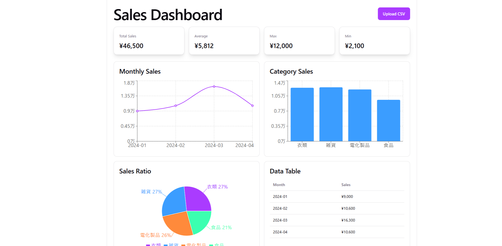
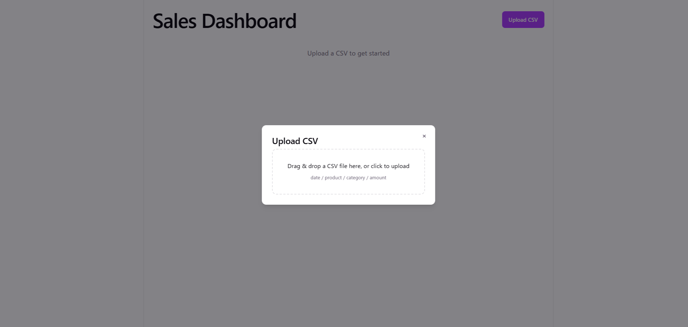
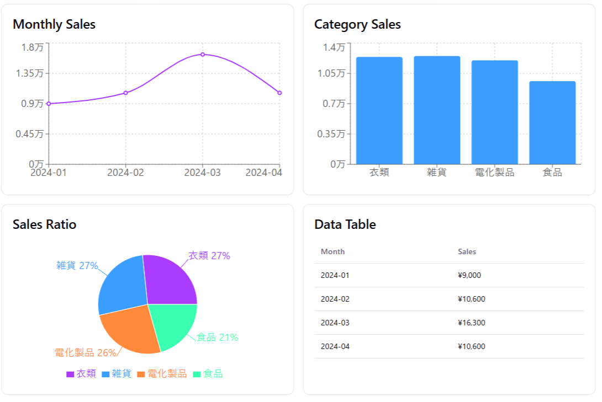

# Sales Dashboard

Upload a CSV file to instantly visualize sales data and get AI-powered business insights via Claude.

**Live Demo**: https://sales-dashboard-frontend-vfmc.onrender.com

**Sample CSV**: https://github.com/Kazz1987/sales-dashboard/raw/main/sample/sample_sales.csv

---

## Screenshots

**Dashboard**


**CSV Upload**


**Monthly Sales Chart**


---

## Features

- **CSV Upload** — drag & drop or click to select; validates format, columns, and file size before processing
- **KPI Cards** — total revenue, average, max, and min at a glance
- **Monthly Trend Chart** — line chart showing revenue over time
- **Category Bar Chart** — compare revenue by product category
- **Sales Ratio Pie Chart** — category share breakdown
- **Data Table** — paginated monthly data in tabular form
- **AI Analysis** — one-click Claude-powered analysis that identifies trends and suggests actionable strategies (Japanese output)

---

## Tech Stack

| Layer | Technology |
|---|---|
| Frontend | React, Recharts, Vite |
| Backend | FastAPI, pandas |
| AI | Claude API (`claude-opus-4-6`) via Anthropic SDK |
| Hosting | Render (frontend + backend) |

---

## CSV Format

| date | product | category | amount |
|---|---|---|---|
| 2024-01-05 | ProductA | Food | 3200 |
| 2024-01-15 | ProductB | Goods | 1500 |
| 2024-02-10 | ProductA | Food | 4200 |

- `date` — `YYYY-MM-DD`
- `product` — product name (any string)
- `category` — category name (any string)
- `amount` — positive number

---

## Security

- **File validation** — extension and `Content-Type` both checked; non-CSV files are rejected
- **File size limit** — uploads over 5 MB are rejected before parsing
- **Input validation** — date and amount fields are coerced; invalid rows are dropped silently; AI analysis input is capped at 10,000 characters via Pydantic
- **CORS** — only the configured origin is allowed; methods restricted to `POST`; headers restricted to `Content-Type`
- **API key management** — `ANTHROPIC_API_KEY` is read from server environment variables and never exposed to the client
- **Error messages** — internal exceptions are logged server-side only; clients receive generic messages with no stack traces or internal details

---

## Local Development

### Prerequisites

- Python 3.10+
- Node.js 18+
- An Anthropic API key (for AI analysis)

### Backend

```bash
cd backend
pip install -r requirements.txt
ANTHROPIC_API_KEY=your_key_here uvicorn main:app --reload
```

The API runs at `http://localhost:8000`.

### Frontend

```bash
cd frontend
npm install
npm run dev
```

Open `http://localhost:5173` in your browser. By default, the frontend points to `http://localhost:8000`. To override, create `frontend/.env.local`:

```
VITE_API_URL=http://localhost:8000
```
